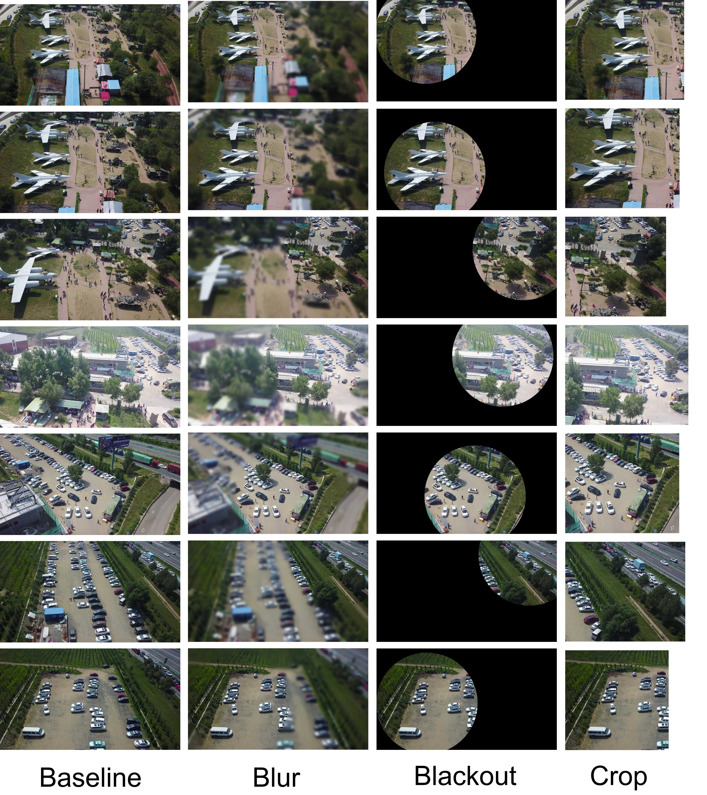
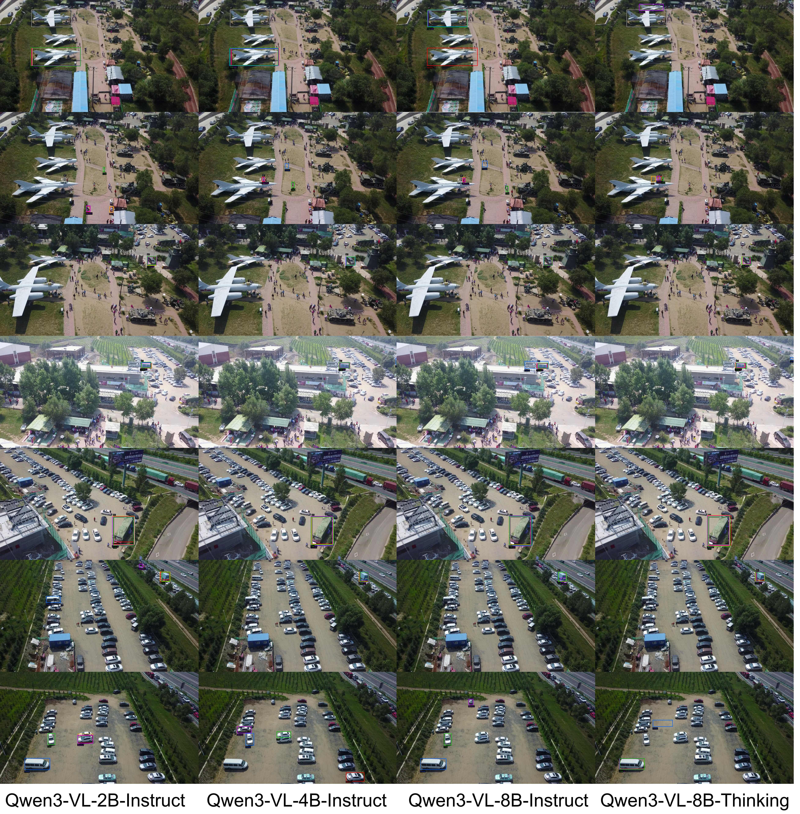
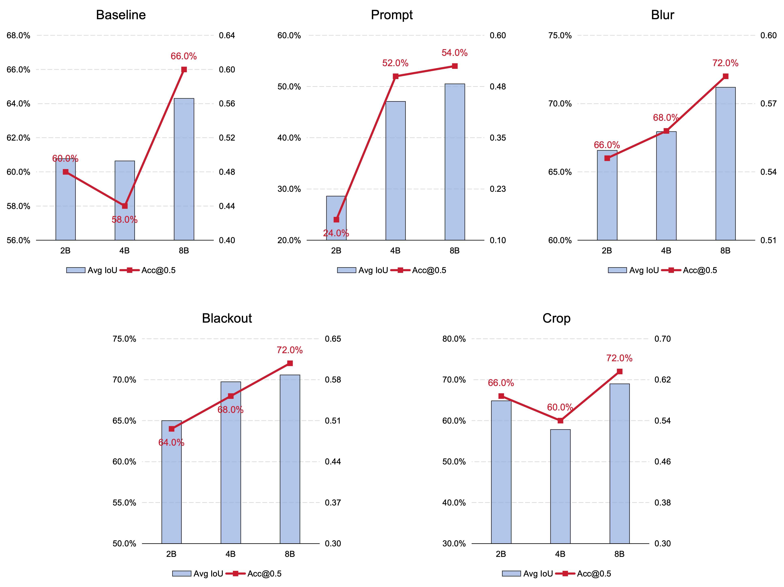
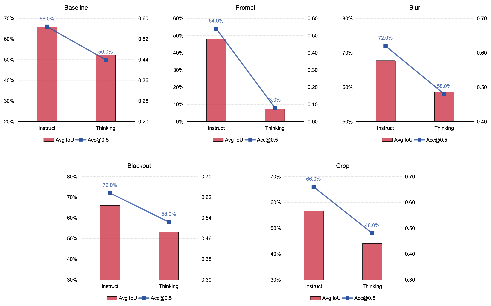
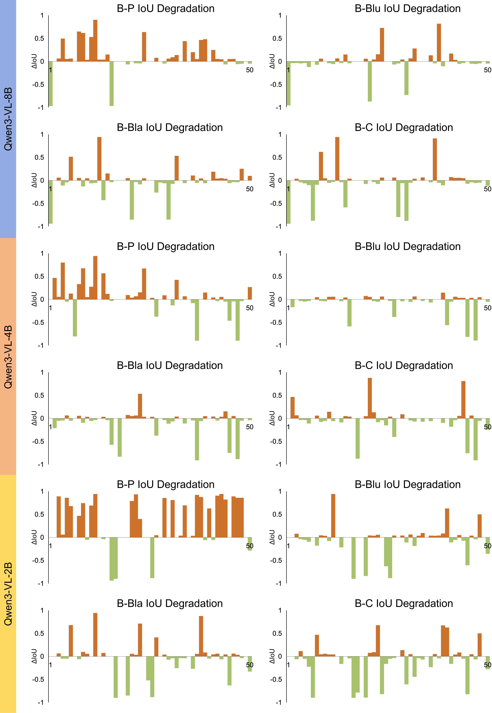

# Architectural Limitations of Vision–Language Models in Implicit Visual Grounding

> Mechanistic Analysis and Diagnostic Experiments

## Overview

This repository provides the evaluation code and experimental analysis for this study on **implicit visual grounding (IVG)** — a task requiring vision–language models (VLMs) to map abstract, high-level semantic queries to precise spatial regions in images. Unlike explicit grounding (e.g., "locate the person riding a bicycle"), implicit grounding demands the coordinated integration of scene understanding, physical commonsense, and fine-grained spatial localisation.

This study identifies **five interconnected architectural limitations** of contemporary VLMs on this task, supported by formal analysis and diagnostic experiments across the Qwen3-VL series (2B / 4B / 8B, Instruct and Thinking variants).

---

## Dataset

The evaluation is built upon **DVGBench** [1], a UAV visual grounding benchmark that contains implicit-semantic queries requiring commonsense reasoning and scene-level understanding beyond simple object retrieval. **50 representative samples** are selected from the DVGBench. Each sample includes:

- A UAV / remote-sensing image
- Entity location annotations (bounding boxes with centre coordinates)
- A natural-language query with implicit semantic demands

**Contribution on the data side:** Manual prompts are designed that incorporate entity-level coordinate annotations to guide the model's attention, and adapt the DVGBench samples for multi-method evaluation across five attention-guiding conditions.

### Data Setup

Please download the DVGBench dataset and place the MCP_test subset under `data/MCP_test/`. See [`data/README.md`](data/README.md) for detailed format specifications.

```
data/
└── MCP_test/
    ├── 50_MCP_test.jsonl
    ├── Prompt_test.jsonl
    └── *.jpg
```

Alternatively, set a custom data path via environment variable:

```bash
export DATA_DIR=/path/to/your/MCP_test
```

---

## Experimental Setup

### Models

| Model                | Variant  | Max Tokens | Description                         |
| -------------------- | -------- | ---------- | ----------------------------------- |
| Qwen3-VL-2B-Instruct | Instruct | 256        | Lightweight instruction-tuned       |
| Qwen3-VL-4B-Instruct | Instruct | 256        | Mid-scale instruction-tuned         |
| Qwen3-VL-8B-Instruct | Instruct | 256        | Large instruction-tuned             |
| Qwen3-VL-8B-Thinking | Thinking | 2048       | Large with extended reasoning chain |

### Five Attention-Guiding Methods

Five information-manipulation methods are designed to probe VLM localisation behaviour under varying informational conditions:

| #   | Method             | Preprocessing                | Prompt Type          | Theoretical Link              |
| --- | ------------------ | ---------------------------- | -------------------- | ----------------------------- |
| (1) | **Baseline** | None                         | Standard             | Innate perceptual capacity    |
| (2) | **Prompt**   | None                         | + entity coordinates | Semantic–spatial alignment   |
| (3) | **Blur**     | Gaussian blur outside target | Standard             | Spatial detail loss           |
| (4) | **Blackout** | Mask outside target in black | Standard             | Information deficit reasoning |
| (5) | **Crop**     | Crop to target region        | Standard             | Fine-grained local perception |

All preprocessing uses a **circular mask** centred on the entity centroid, with radius = min(image width, image height) / 2.


*Fig. 1 — Illustration of the five attention-guiding methods for probing VLM localisation behaviour.*

---

## Experimental Results

### Key Findings

**(1) Model-scale effect.** The 8B model achieves the highest or tied-highest Acc@0.5 across all five methods. The 2B model ranks lowest overall, though not uniformly — its Baseline Acc@0.5 of 0.60 exceeds the 4B model's 0.58. Positive but non-monotonic scaling, consistent with diminishing marginal returns.

**(2) Universal degradation under Prompt.** All four configurations show performance drops. The most extreme: Qwen3-VL-8B-Thinking's Prompt accuracy collapses from 0.50 to 0.08 — an **84% relative drop**.

**(3) Consistent positive effects of Blur and Blackout.** Both methods consistently improve performance relative to Baseline across all Instruct models.

**(4) Instruct outperforms Thinking.** Instruct mode outperforms Thinking across all five methods. Mean Acc@0.5: **0.62 vs 0.44** (18 percentage-point gap).


*Fig. 2 — Predicted and ground-truth bounding boxes across the five attention-guiding methods.*


*Fig. 3 — Acc@0.5 and mean IoU of the 2B, 4B, and 8B Instruct models across the five attention-guiding methods.*


*Fig. 4 — Acc@0.5 and mean IoU comparison between Qwen3-VL-8B-Instruct and Qwen3-VL-8B-Thinking.*

---

## Analysis

The following observations are summarised here; for the full formal analysis of each limitation — including theoretical derivations, upper-bound estimates, and their cascading interactions — see [`main.pdf`](main.pdf).

### Model Scale Amplifies Alignment Fragility


*Fig. 5 — Per-sample IoU difference from Baseline for each of the four methods, shown across the three model scales (2B / 4B / 8B). Each sub-panel displays the IoU gap (method minus Baseline) for individual images.*

Under Baseline / Blur / Blackout / Crop, performance varies within 10%, suggesting visual feature extraction has converged even in lightweight models. Under Prompt, the 2B model drops ~30% relative to 8B, indicating insufficient language–vision alignment stability at small parameter counts.

### Prompt Failure Reflects Structural LM Constraints

When coordinates are injected as tokens, the language-modelling objective dominates. The model prioritises *how* coordinates are expressed over *which* regions they designate. Three-way token alignment (Prompt + visual + question) demands greater capacity.

### Information Absence Improves Performance

Blur / Blackout / Crop all reduce background token interference, effectively compressing visual information into fewer, more salient tokens. This suggests that VLMs allocate limited token budgets across the entire image, and background reduction benefits spatial accuracy.

---

## Mechanistic Framework

These patterns are attributed to five interconnected architectural limitations:

| # | Limitation                | Evidence                                                                                   |
| - | ------------------------- | ------------------------------------------------------------------------------------------ |
| 1 | Visual token compression  | Background masking improves performance → background competes for limited token resources |
| 2 | Causal attention limits   | Prompt injection interferes → attention governed by semantics, not spatial proximity      |
| 3 | RoPE 1D bias              | Precise coordinates fail → RoPE cannot handle exact Cartesian values                      |
| 4 | LM vs. spatial regression | Prompt universally fails → LM objective dominates spatial accuracy                        |
| 5 | Progressive attenuation   | Crop outperforms Baseline → deep representations lack fine-grained detail                 |


---

## Project Structure

```
├── new_test_3090/                  # Instruct model evaluation
│   ├── eval.py                     # Main evaluation script
│   ├── config.py                   # Model & method configurations
│   ├── generate_excel.py           # Excel report generator
│   ├── visualize_comparison.py     # HTML visualisation report
│   └── run_all.sh                  # One-click batch runner (3 models × 5 methods)
│
├── new_test_3090_thinking/         # Thinking model evaluation
│   ├── eval.py                     # Evaluation script (Thinking-optimised bbox parsing)
│   ├── config.py                   # Thinking model configurations (MAX_TOKENS=2048)
│   ├── generate_excel.py
│   ├── visualize_comparison.py
│   └── run_all.sh
│
├── Results/                        # Pre-computed evaluation results
│   ├── results_2b_inst/            # 2B-Instruct: 5 methods × .jsonl
│   ├── results_4b_inst/            # 4B-Instruct
│   ├── results_8b_inst/            # 8B-Instruct
│   └── results_8b_think/           # 8B-Thinking
│
├── data/
│   ├── MCP_test/                   # DVGBench subset: 50 images + 2 JSONL annotation files
│   └── README.md                   # Data format specification
│
├── figures/                        # Paper figures
├── main.pdf                        # Full paper with formal derivations
├── visualize_all_methods.py        # Cross-method visualisation
└── eval_study.py                   # Supplementary analysis
```

---

## Quick Start

### Prerequisites

```bash
pip install -r requirements.txt
```

The four Qwen3-VL models (2B/4B/8B Instruct + 8B Thinking) are downloaded automatically from HuggingFace on first run. To use a mirror (for users in China), set:

```bash
export HF_ENDPOINT=https://hf-mirror.com
```

### 1. Prepare Data

Download DVGBench and place `MCP_test` under `data/`:

```bash
# Option A: Use default path
ln -s /path/to/MCP_test data/MCP_test

# Option B: Set environment variable
export DATA_DIR=/path/to/MCP_test
```

### 2. Run a Single Evaluation

```bash
# Instruct models
cd new_test_3090
python eval.py 8b_inst baseline
python eval.py 4b_inst blur

# Thinking models
cd new_test_3090_thinking
python eval.py 8b_think baseline
```

### 3. Run All Experiments

```bash
# Instruct: 3 models × 5 methods = 15 experiments
cd new_test_3090 && bash run_all.sh

# Thinking: 3 models × 5 methods = 15 experiments
cd new_test_3090_thinking && bash run_all.sh
```

### 4. Generate Reports

```bash
# Excel summary (per model)
python generate_excel.py 8b_inst

# HTML visual report (per model)
python visualize_comparison.py 8b_inst
```

---

## Configuration

Edit `config.py` to adjust parameters, or use environment variables:

| Parameter            | Default                          | Env Var      | Description               |
| -------------------- | -------------------------------- | ------------ | ------------------------- |
| `DATA_DIR`         | `./data/MCP_test`              | `DATA_DIR` | Test data directory       |
| `BASE_DIR`         | `./Results`                    | `BASE_DIR` | Output directory          |
| `MAX_TOKENS`       | 256 (Instruct) / 2048 (Thinking) | —           | Max generation tokens     |
| `NUM_SAMPLES`      | 50                               | —           | Number of test samples    |
| `MAX_IMAGE_DIM`    | 1600                             | —           | Resize threshold (px)     |
| `BLUR_KERNEL_SIZE` | 51                               | —           | Gaussian blur kernel size |
| `IOU_THRESHOLD`    | 0.5                              | —           | Success threshold         |

---

## Output Files

Each experiment produces:

| File                                | Description                                                       |
| ----------------------------------- | ----------------------------------------------------------------- |
| `<method>_results.jsonl`          | Per-sample results (predicted bbox, IoU, status)                  |
| `vis_images/`                     | Visualisations with GT (green) and predicted (red) bounding boxes |
| `evaluation_results_<model>.xlsx` | Excel summary with per-method sheets                              |
| `comparison_report_<model>.html`  | Interactive HTML report (generated locally, not tracked in repo)  |

---

## Coordinate System

The model outputs bounding boxes as normalised coordinates in `[0, 1000]`. The evaluation script automatically:

1. Denormalises predictions to pixel coordinates
2. Rescales GT boxes to match resized image dimensions
3. For the `crop` method, transforms GT coordinates to the cropped coordinate system

---

## Contributions

1. **Mechanistic framework**: Five interconnected architectural limitations identified through formal analysis (information theory, spectral graph theory, optimisation theory)
2. **Diagnostic experimental design**: Five attention-guiding methods that isolate specific failure modes through controlled information manipulation
3. **Manual prompt engineering**: Entity-level coordinate prompts designed to test semantic-spatial alignment under controlled information conditions
4. **Cross-architecture comparison**: Systematic evaluation across 3 model scales (2B / 4B / 8B) and 2 paradigms (Instruct / Thinking)

---

## Citation

If you use DVGBench as the underlying data source, please cite:

```bibtex
@article{zhou2026dvgbench,
  author={Zhou, Yue and Chen, Jue and Huang, Penghui and Ding, Ran and Zou, Zhentao and Gao, Pengfei and Li, Ke and Yang, Xue and Jiang, Xue and Yang, Hongxin and Li, Jonathan},
  journal={ISPRS Journal of Photogrammetry and Remote Sensing},
  title={DVGBench: Implicit-to-Explicit Visual Grounding Benchmark in UAV Imagery with Large Vision-Language Models},
  year={2026},
  volume={232C},
  pages={831-847}
}
```

---

## Limitations and Future Directions

This work represents a preliminary exploration conducted within a limited timeframe. I hope to extend this line of research toward more systematic, multimodal evaluations of implicit visual grounding, and to develop more effective methods for addressing the architectural limitations of VLMs on IVG tasks. Insights and collaboration from researchers with experience in related areas are warmly welcome.

---

## License

This project is licensed under the MIT License. See [LICENSE](LICENSE) for details.

## Contact

Ziang Wang — patrickshou2580@gmail.com
